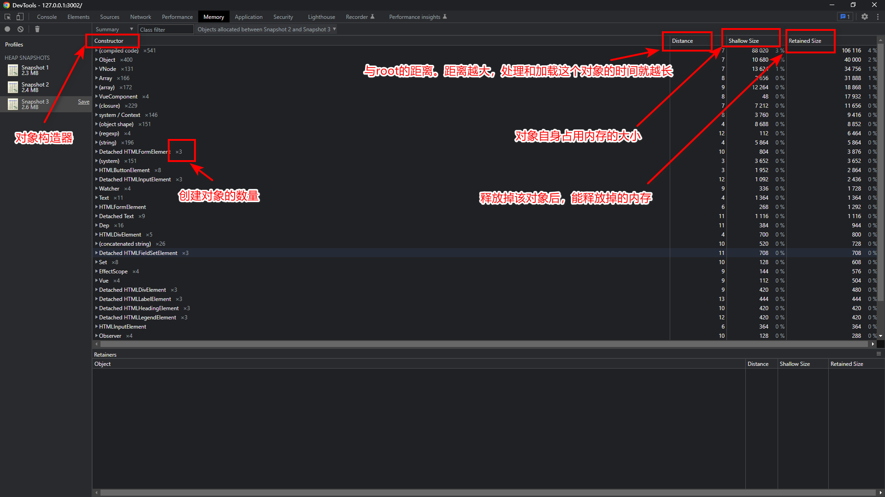
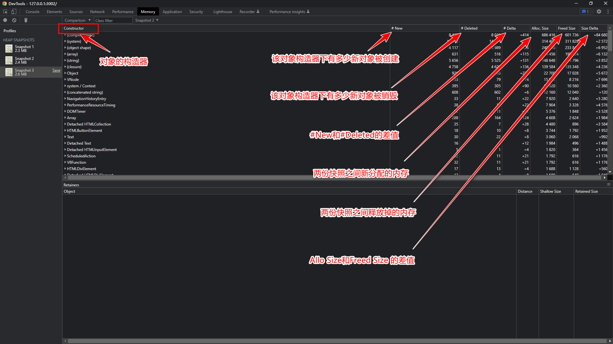
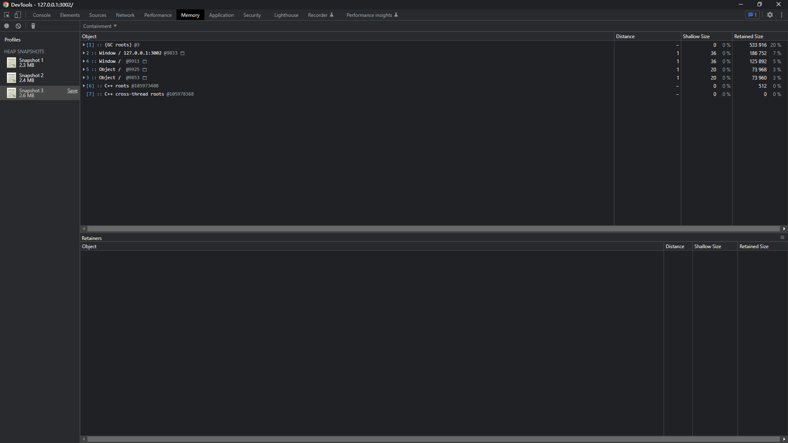
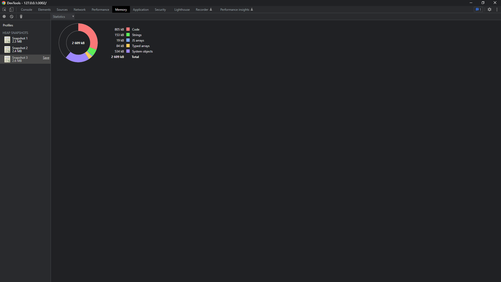

# 内存泄漏

## 理论

### 概念

* 程序在申请内存后，无法释放已申请的内存空间

#### 与内存溢出的关系

* 内存溢出是程序在申请内存时，没有足够的内存空间供其使用
* 是内存泄漏的最终结果

### 垃圾回收（GC）

#### 内存资源是有限的，所以需要`适当的时机`释放`合适的资源`，因此就出现了`垃圾回收（Garbage Collection）`

##### "垃圾"如何认定

* 引用计数（Reference Counting）：引擎检测一个对象是否有其他对象引用，如果引用为0则释放，反之不释放
* 可达性分析（GC Roots Tracing）：从 GC Roots 开始向下搜索，搜索所走过的路径称为引用链。当一个对象到 GC Roots 没有任何引用链相连时，则证明此对象是可以被回收的。

##### 怎么回收“垃圾”

* 标记-清除（Mark-Sweep）：标记无用对象，然后进行清除回收

* 复制收集（Copy and Collection）：按照内存容量划分为两块大小相等的区域，当一块用完的时候将“活着”的对象复制到另一块上去，然后清除已沾满块的内存

* 标记-整理（Mark-Compact）：标记无用对象，让所有存活的对象都向一端移动，然后直接清除掉端边界以外的内存

* 分代收集（Generational Collecting）：根据对象存货周期的不同将内存划分为几块，一般是新生代和老年代，新生代基本采用复制算法，老年代采用标记-整理算法

### 为什么在SPA下内存泄漏的出现的如此频繁？

#### CSR（Client-Side Rendering）vs SSR（Server-Side Rendering）

* CSR, 使用JavaScript渲染页面，用户体验较好
* SSR, 页面再服务器端渲染好后发送到浏览器，渲染速度快

#### 前端越来越“重”（大势所趋）

### 内存管理

#### 内存模型

* 栈

> 栈是一块按后进先出规则访问的存储区域，主要存放程序运行时函数的参数与局部变量等

* 堆

> 堆表示一块存储区域，对该存储区域的访问是任意的，没有后进先出的要求，主要用于在程序运行时动态分配内存，比如new一个新的对象，就是在堆中分配存储空间的，一般由程序员手动控制，但也容易造成内存泄漏

#### 如何释放内存

##### 堆内存释放

```js
var obj = {p1: 'hi'}

obj = null // 释放
```

##### 栈内存释放

* 全局作用域

> 在全局作用域下，只有当页面关闭的时候，全局作用域才会被销毁。

* 私有作用域

> 一般来说，私有作用域下的代码执行完后，会主动销毁和释放。
> 但有一些特殊的情况：当私有域中有部分内容被之外的地方引用，那么当前作用域就不会销毁

#### 常见的内存泄漏

##### 全局变量

```js
function createGlobalVariables() {
    // 没有声明从而制造了隐式全局变量leaking1
    leaking1 = 1000;

    // 函数内部this指向window，制造了隐式全局变量leaking1
    this.leaking2 = 2000;
}

createGlobalVariables()

console.log(window.leaking1) // 1000
console.log(window.leaking2) // 2000
```

###### 如何避免：使用严格模式(“use Strict”)，来消除Javascript语法的一些不合理、不严谨之处，减少一些怪异行为;

##### 闭包

```js
function closure() {
    var num = 100;
    return function () {
        num++;
        console.log(num);
    }
}

var fn = closure(); // closure执行形成的作用域就不能再销毁了

// fn = null
```

###### 如何避免：闭包是JS中重要的部分，因此怎么“合理”使用闭包至关重要，比如在什么时候创建闭包？保留了哪些对象？

##### 脱离（Detached）的DOM元素

```js
function createElement() {
    const div = document.createElement('div');
    div.id = 'detached';
    return div;
}

// 这将继续对‘div’的引用，即使调用了deleteElement()
const detachedDiv = createElement();

document.body.appendChild(detachedDiv);

function deleteElement() {
    document.body.removeChild(document.getElementById('detached'));
}

deleteElement();
```

###### 如何避免：将对DOM的引用移到局部作用域

```js
function createElement() {
    const div = document.createElement('div');
    div.id = 'detached';
    return div;
}

// 将对DOM的引用移到局部作用域
function appendElement() {
    const detachedDiv = createElement();
    document.body.appendChild(detachedDiv);
}

appendElement();

function deleteElement() {
    document.body.removeChild(document.getElementById('detached'));
}

deleteElement();
```

##### **事件监听器**

```js
const hugeString = new Array(100000).join('x');

document.addEventListener('keyup', function () {
    doSomething(hugeString); // hugeString 会一直保留不会被GC回收
});
```

###### 如何避免：一旦不再需要事件监听器，记得调用removeEventListener方法来注销事件监听器

##### *观察者模式*

* eventBus

##### **计时器**

* setInterval

###### 如何避免：获取计时器的引用，在“合适”的时机清理掉计时器

##### 强引用对象

> Map, Set

```js
let addrs = {city: '北京', district: '海淀'};
let student = {name: '小强', address: addrs}
let myset = new Set([student])

student = null
console.log(myset)
```

###### 如何避免：使用WeakMap, WeakSet（ES6）

```js
let addrs = {city: '北京', district: '海淀'};
let student = {name: '小强', address: addrs}
let weakSet = new WeakSet([student])
// weakSet.add(student)

student = null

setInterval(() => {
    console.log('===', weakSet)
}, 5000)
```

##### **Console**

> 浏览器会记录console里对象引用，因此console参数为对象的话，也会造成不释放

###### 如何避免：在`build`阶段清除console.log相关代码

## 实战

### 怎么排查？

#### 工欲善其事必先利其器

> Performance + Memory

##### Memory

* Summary（摘要） view就是当前内存快照的一个概览



* Comparison（比较）view可以让你对比两份内存快照之间的差异



* Containment（包含） view提供了一个自下而上的视图，用来分析一些全部变量的引用情况



* Statistics（统计） view用饼图的形式展示各个类型对象的内存占比



#### Tips

1. 使用浏览器无痕模式
2. 尽量使用没有混淆的代码
3. 排查问题时使用线上的代码
4. 在现场打内存快照，便于跳转到源代码所在行
5. Retained Size > Shallow Size
6. Maximum Count of Objects

#### 方法

* ["3 snapshot"](http://t.co/NUAHugSZ) (2012)

* 我的方法

  > 一、看Performance面板，打开记录一段时间，看内存增长曲线是否有异常
  >
  > 二、看Memory面板，选择“Allocation sampling（分配采样）”开始记录
  >
  > 三、多操作几遍
  >
  > 四、回到Memory面板，查看“Chart”找出红/黄色区域，点进去查看代码是否有问题

### 项目案例

#### addEventListener

* 回调函数执行几次？

#### vue directives

* DOM移除后，已注册的事件也会随着销毁吗？

#### setInterval

* clear

#### keep-alive

* max

#### 终极杀器

* window.gc
